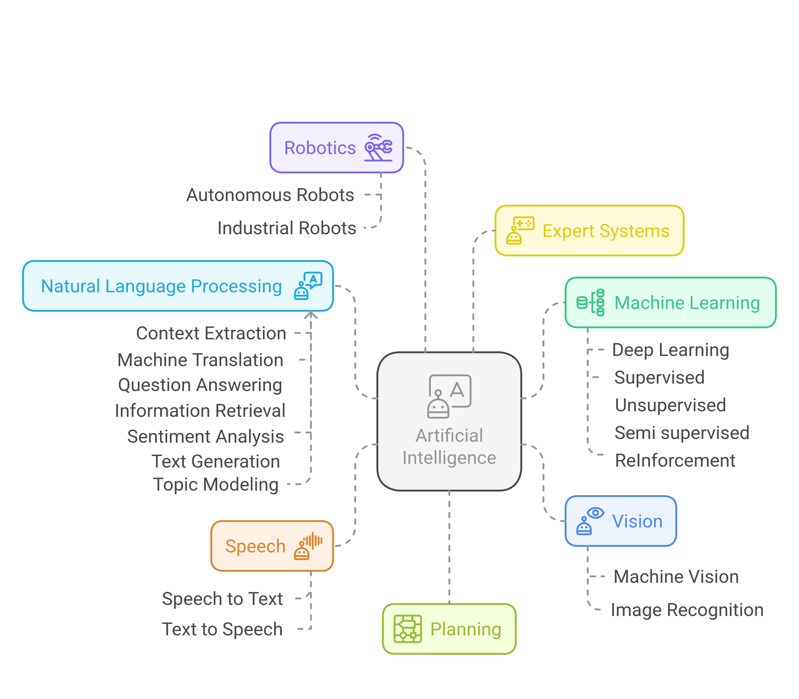
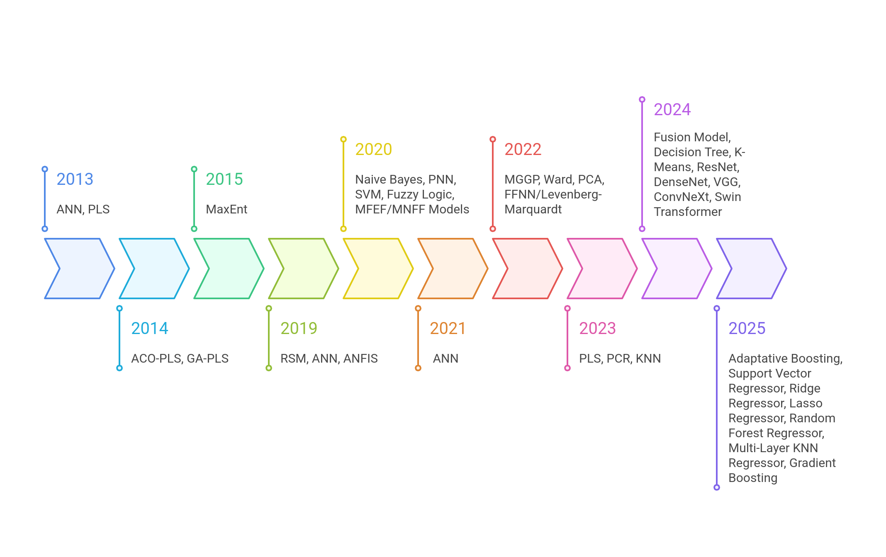
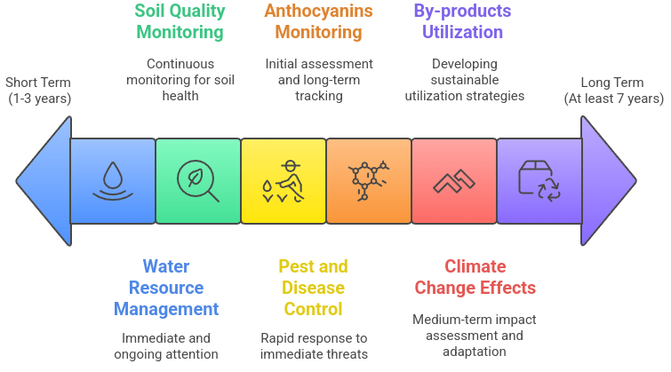

# AI-Generated Visualizations — Figures 1, 3, and 6

This repository contains three figures generated using [Napkin.app](https://www.napkin.io/), created as part of a systematic review on the application of Artificial Intelligence (AI) in *Hibiscus sabdariffa* research. These visuals summarize key concepts, the evolution of methodologies, and future research directions.

---

## Figure 1 – Conceptual Map of Artificial Intelligence

This mind map was inspired by the following reference and illustrates the main branches and applications of AI.

📚 **Reference**:  
Benavides, Liliana; Goytia, Edgar; Ramírez, Luisa. (2023). *El uso de la inteligencia artificial en un entorno académico*. Ciencia Nicolaita.  
🔗 [https://doi.org/10.35830/cn.vi89.721](https://doi.org/10.35830/cn.vi89.721)

### Content

Artificial Intelligence (IA)
1. Machine Learning
	1. Deep Learning
	2. Supervised
	3. Unsupervised
	4. Semi Supervised
	5. Reinforcement
2. Natural Language Processing (NLP)
	1. Context Extraction
	2. Machine Translation
	3. Question Answering
	4. Text Generation
	5. Informtion Retrieval
	6. Sentiment Analysis
	7. Topic Modeling
3. Expert Systems
4. Vision
	1. Image recognition
	2. Machine vision
5. Speech
	1. Speech to Text
	2. Text to Speech
6. Planning
7. Robotics
	1. Speech to Text
	2. Text to Speech

🛠️ *Note*: The Napkin-generated image was post-edited for icon consistency and semantic clarity.

📷 **Figure 1**:  

---

## Figure 3 – Timeline of AI Methods in *Hibiscus sabdariffa*

This timeline illustrates the chronological appearance of AI methods applied in studies that met the inclusion criteria of using AI and *Hibiscus sabdariffa*.

📚 **Data Source**:  
Systematic review conducted as part of this study (only papers meeting inclusion criteria were used).

### Timeline Content

2013: ANN, PLS
2014: ACO-PLS, GA-PLS
2015: MaxEnt
2019: RSM, ANN, ANFIS
2020: Naive Bayes, PNN, SVM, Fuzzy Logic, MFEF/MNFF Models
2021: ANN
2022: MGGP, Ward, PCA, FFNN/Levenberg-Marquardt
2023: PLS, PCR, KNN
2024: Fusion Model, Decision Tree, K-Means, ResNet, DenseNet, VGG, ConvNeXt, Swin Transformer
2025: Adaptive Boosting, Support Vector Regressor, Ridge Regressor, Lasso Regressor, Random Forest Regressor, Multi-Layer KNN Regressor, Gradient Boosting

🛠️ *Note*: The timeline was adjusted after generation to correct visual and chronological inconsistencies.

📷 **Figure 3**:  

---

## Figure 6 – Time Horizon for AI Applications in Agriculture

This diagram outlines AI applications in agriculture according to short-, mid-, and long-term priorities. The structure was inspired by strategic planning models in international development.

📚 **Reference**:  
Nissan, H.; Goddard, L.; Coughlan de Perez, E.; et al. (2019). *On the Use and Misuse of Climate Change Projections in International Development*. WIREs Climate Change, 10, e579.  
🔗 [https://doi.org/10.1002/wcc.579](https://doi.org/10.1002/wcc.579)

### Table of Research Horizons

| Research directions | Short term (1-3 years) | Both horizons (4-6 year) | Long term (6-10 years) |

| ----------------------------- | ----------- | ------------- | ----------- |

| Water Resource Management | 3 | 6 | 10 |

| Soil Quality Monitoring   | 3 | 6 | 10 |

| Climate Change Effects    |   | 6 | 10 |

| Pest and Disease Control  | 3 | 6 | 10 |

| Anthocyanins Monitoring   | 3 |   | 10 |

| By-products Utilization   |   | 6 | 10 |

🛠️ *Note*: Final edits were applied after Napkin generation to correct terminology and color clarity.

📷 **Figure 6**:  

---

